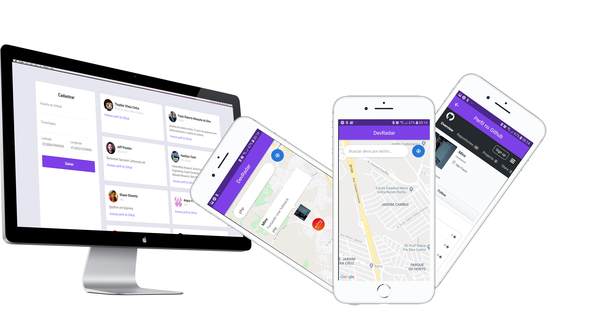

# RadarDev  

### This is a study project only and has no involvement with the Airbnb brand. :books:

### :electric_plug: Requeriments

- Node.JS >= 10.16.2
- Yarn >= 1.17.3
- Expo >= 3.1.2
- NPM >= 6.9.0

### Getting started - Backend

#### :warning: IMPORTANT :warning:
_To make your own changes, please create your cluster in <a href="https://www.mongodb.com/">MongoDB Atlas</a>_

After create and init the cluster, change the database config in <b>backend/src/server.js</b> file 
`mongoose.connect('your-mongodb-connect-here` 

:heavy_exclamation_mark: The backend will start on 4100 port

### :computer: Getting started the frontend 

:heavy_exclamation_mark: The frontend will start on 3000 port

### :iphone: Getting started the mobile 

:heavy_exclamation_mark: The backend will start on 19002 port and the Expo client on <b>exp://YourLocalIP:19000</b> or Tunnel.

